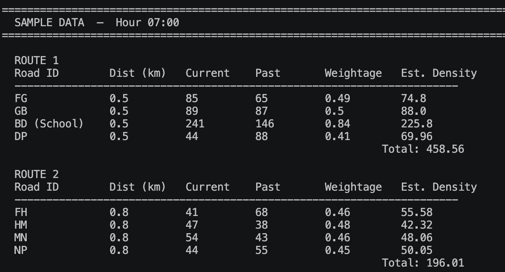
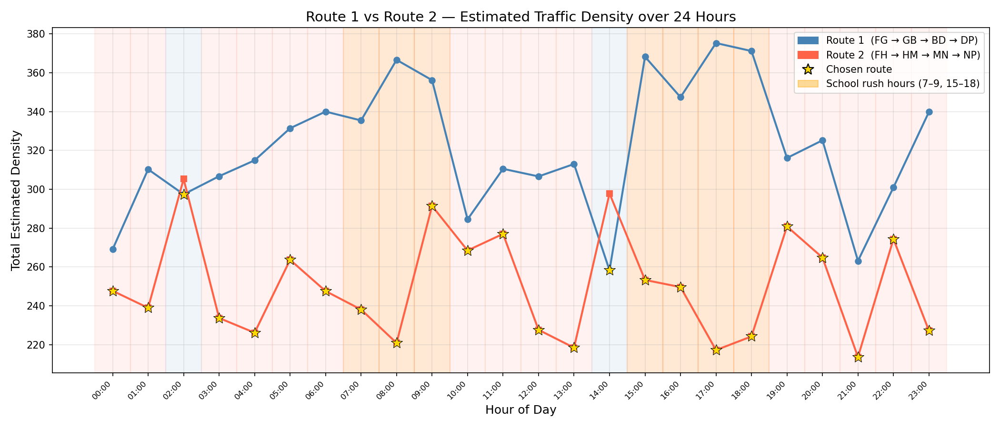

## Lab Activity 2: Playing the Role of the Traffic Control Center (Python Interpretation Lab)

### Objective
Students will run a pre-written, plug-and-play Python script using their exact Excel data, shifting their focus from writing code to interpreting AI model outputs for public policy decisions.
**Task**
- Save your exact spreadsheet as a .csv file.
- Copy and run the following simplified, pre-made Python code block.
- _The Assignment Question_: Read the printout generated by the code. Write a non-technical summary explaining what the "Intercept" and "Coefficients" mean as if you were explaining them to a city mayor. 

## Attempt
A CSV file is created, and it will represent the state a specific time or timeslot. The following is a sample data at Hour 7.

Past and Present Traffic Density and Weightages are generated randomly for the segments, except the school zone segment (BD) will have higher density and weightage within the school rush hours. (7,8,9,15,16,17, 18).

The script will run and draw for 24 hours frame generating data for each hour for simulation. Below is a sample chart from one simulation run.

The road density estimation formula is as follows:
Estimated Density = Weightage * Current Density + (1 - Weightage) * Past Density

This formula is comparable to the classic slope formula **y = mx + b** where **m (coefficient)** is the Weightage — how much trust is given to the live traffic reading — and **b (intercept)** is `(1 − m) × Past Density` — the historical baseline the system falls back on.

Based on that view, the process of prediction can be viwed this way.
- When the Weightage is 0.5, then it means, the Estimated Density will be calculated as the summation of 50% from the current density and 50% from the past density — in other words, putting the equal trust to both, simply meaning that the situation is stable and predictable.  

- When the Weightage is higher, e.g. 0.8, then it means, higher trust should be put in the current density, in other words, the situation is highly variable and difficult to guess, and so current condition should be taken as a more deciding factor. 